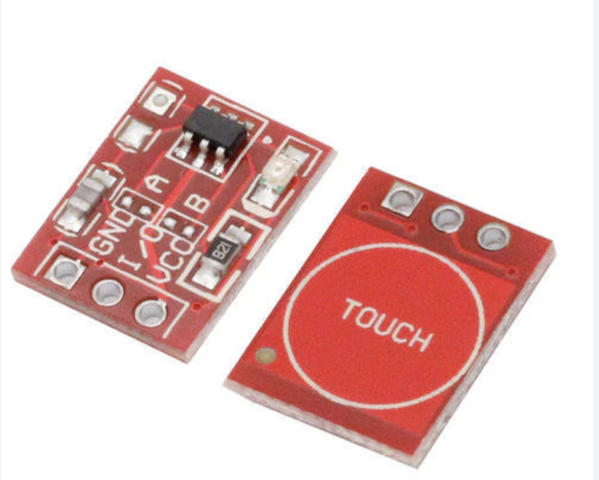
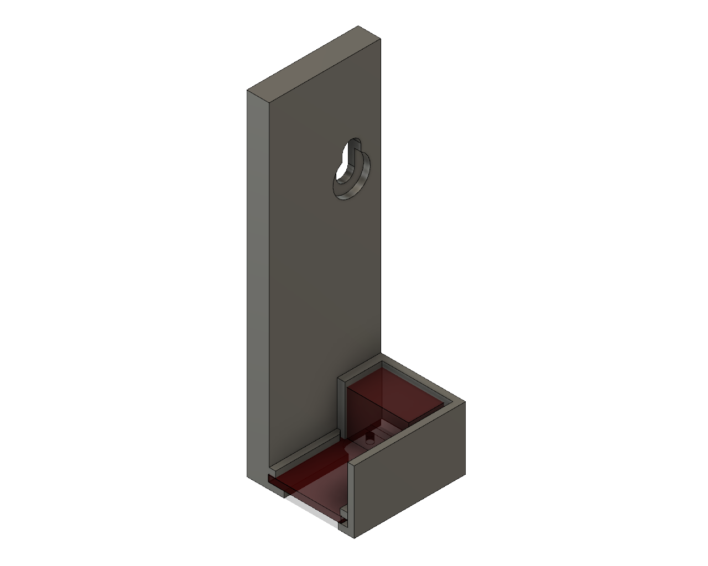
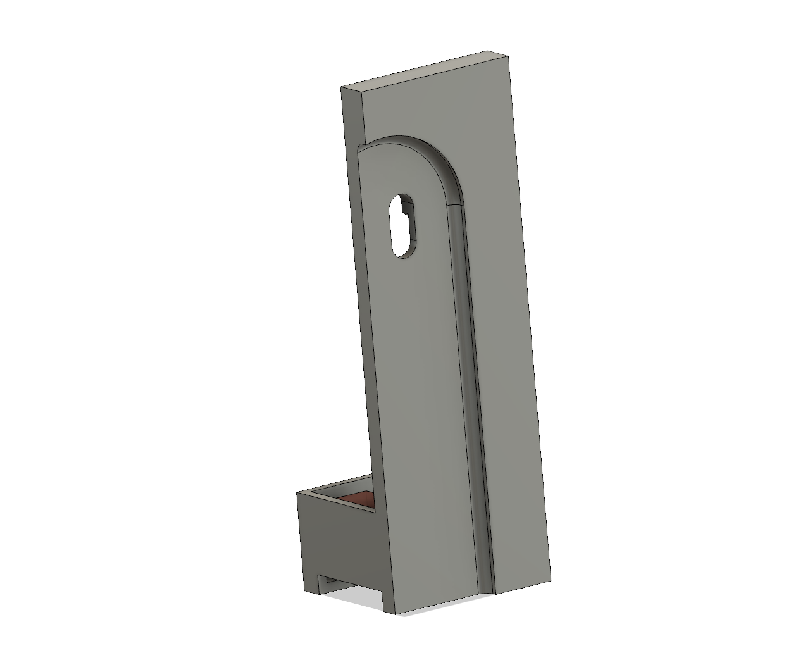
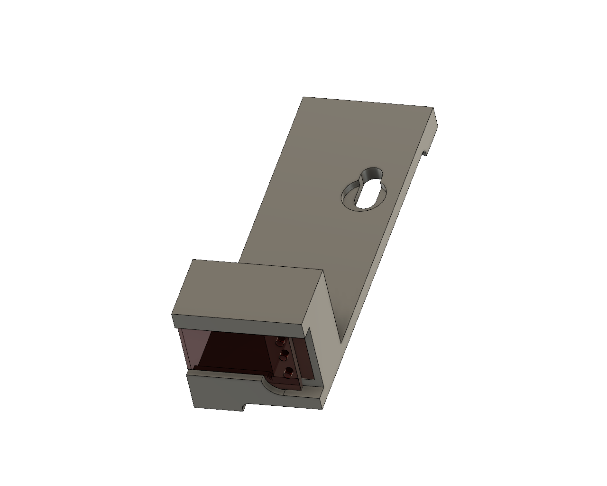
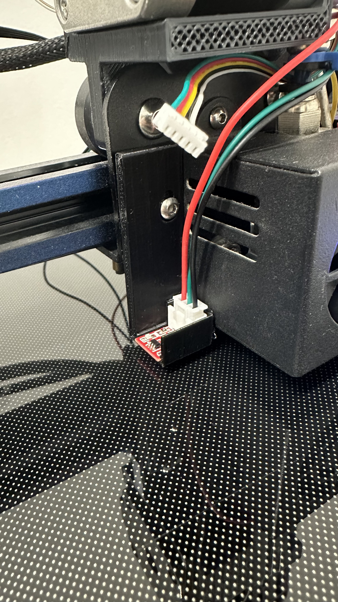

# Klipper TTP223 Z-Probe sensor

***The Power of the TTP223 Conductivity Sensor***
The TTP223 is a small sensor that offers big opportunities. Designed to detect close objects or even human touch, this device has incredible accuracy, with a sensing distance of approximately 5 mm. Imagine having the ability to detect objects so close with such accuracy; it's like the magic of 3D printing come to life.

## An Innovative Integration
The brilliant idea here is to use this sensor in conjunction with Klipper, the open source firmware that powers many 3D printers. The proposal is to connect the TTP223 as an "inductive Z-endstop." In simple terms, the idea is to use this sensor to monitor the Z-position (the height) of the printer throughout the printing process.

## The Steps to the Magic
Here are the key steps to make this idea a reality:

***Solder a Three-Pin Connector:*** In order for the TTP223 sensor to connect seamlessly with Klipper, we need to solder a three-pin connector to the sensor. This will ensure a reliable and stable connection.

***Strategic Location:*** Since this sensor has a short sensing distance of about 5 mm, its location on the printer is critical. It must be strategically located to detect the printing surface or the object in process.

***Connecting to the BLTouch Connector:*** To attach the sensor to Klipper, simply connect the three-pin connector from the TTP223 to the BLTouch connector on the controller board. A little tip: make sure that pins A and B on the board are unsoldered or free, as they will be used for the sensor connection.



## SKR MINI v3.1

```
#BLTouch pinout

* PC14
* GND
* PA1 <- I/O
* PWR <- VCC
* GND <- GND
```

```
#Z-Stop pinout
* GND <- GND
* PC2 <- I/O
* Other 5v pin <- VCC
```

## printer.cfg

```
[probe]
pin: PA1 #(or PC2 if you use stock z-endstop pin)
x_offset: -43
y_offset: -13
speed: 2
lift_speed: 30.0
samples: 2
samples_result: median
sample_retract_dist: 2
samples_tolerance: 0.09
z_offset: 0.0 

[stepper_z]
endstop_pin: probe:z_virtual_endstop #^PC2
#position_endstop: 0.0 #removed because use bltouch
```

## Probe
1) run command `Z_PROBE`
2) after config offset run `SAVE_CONFIG`
3) accuracy `PROBE_ACCURACY`

### probe test results

```
probe accuracy results: maximum 0.042500, minimum -0.102500, range 0.145000, average -0.033250, median -0.043750, standard deviation 0.043345
probe at 125.000,125.000 is z=-0.102500
probe at 125.000,125.000 is z=-0.052500
probe at 125.000,125.000 is z=-0.077500
probe at 125.000,125.000 is z=-0.055000
probe at 125.000,125.000 is z=-0.037500
probe at 125.000,125.000 is z=-0.027500
probe at 125.000,125.000 is z=-0.005000
probe at 125.000,125.000 is z=-0.050000
probe at 125.000,125.000 is z=0.032500
probe at 125.000,125.000 is z=0.042500
PROBE_ACCURACY at X:125.000 Y:125.000 Z:10.000 (samples=10 retract=2.000 speed=2.0 lift_speed=30.0)
```






<video src="Images/IMG_4274.MOV-out.mp4" controls>

### Docs
   * https://github.com/bigtreetech/BIGTREETECH-SKR-mini-E3/blob/master/hardware/BTT%20SKR%20MINI%20E3%20V3.0/Hardware/BTT%20E3%20SKR%20MINI%20V3.0_PIN.pdf
   * https://infusionsystems.com/support/TTP223.pdf